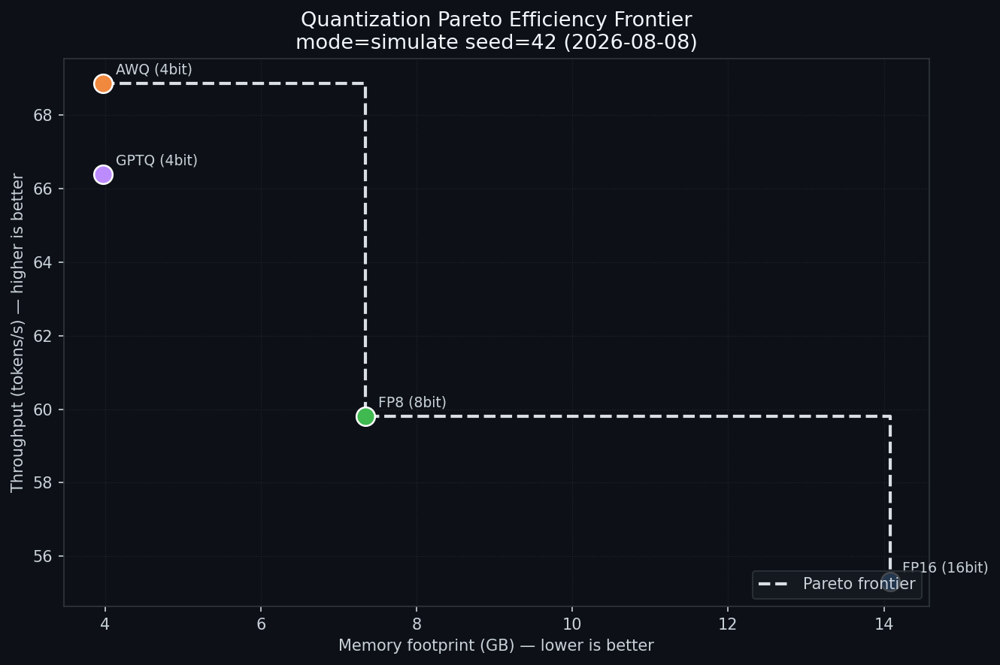

# Quantization & Speculative Decoding Benchmarking Engine

[](https://www.python.org/)
[](LICENSE)

An **end-to-end automated benchmarking engine** for LLM **quantization**
(FP16 / FP8 / AWQ / GPTQ) and **speculative decoding** (draft/target pairing
with domain-specific acceptance rates). It produces the **Pareto Efficiency
Frontier** and a technical writeup — so engineering never ships a dominated
configuration.



## What it does

- **Quantization matrix** — benchmarks FP16, FP8 (bitsandbytes), AWQ, and GPTQ
  on a target model, reporting throughput, latency (mean/median/p90), memory
  footprint, and a quality proxy (perplexity) with full provenance.
- **Speculative decoding** — pairs draft models (Llama-2-1B, Llama-2-3B,
  Medusa, EAGLE) with a target model and reports **per-domain acceptance
  rates** (code, math, reasoning, chat, summarization) and speedups using the
  standard expected-tokens formula.
- **Pareto frontier** — computes the set of non-dominated configurations
  (minimize memory + latency, maximize throughput) and renders the chart.
- **Technical writeup** — a generated, provenance-stated report you can act on.
- **Company Brain** — `brain/` holds strategy, SOPs, agent profiles, and the
  taste reference the Eval Loop judges against.
- **Gated DevOps** — `scripts/push_to_github.sh` enforces the pre-push
  checklist, commits, and pushes to GitHub as a verified orchestrator task.

## Quickstart

```bash
# 1. One-command environment setup (creates .venv, installs pinned deps)
python3 infra/setup.py

# 2. Run the full pipeline (simulated, deterministic — no GPU needed)
python -m orchestrator.pipeline --mode simulate --seed 42

# 3. View the docs / landing dashboard
bun server.js            # http://0.0.0.0:4173  (or: npm run dev)
```

Or run individual modules:

```bash
python -m benchmarks.quantization_runner --mode simulate --seed 42
python -m benchmarks.speculative_runner --mode simulate --seed 42
python scripts/generate_pareto.py
python scripts/generate_writeup.py
```

## Outputs

| Artifact | Path |
| --- | --- |
| Merged metrics (provenance-stamped) | `artifacts/raw_metrics.json` |
| Pareto efficiency frontier chart | `artifacts/pareto_frontier.png` |
| Technical writeup | `artifacts/technical_writeup.md` |
| Pipeline status | `results/run_status.json` (raw outputs, gitignored) |
| README PDF | `Quant_Benchmarking_Readme.pdf` |
| Setup guide PDF | `Quant_Benchmarking_Setup_Guide.pdf` |
| Dev log & lessons | `GITMORE.md`, `tasks/lessons.md` |

## Live (GPU) mode

The default `--mode simulate` validates the whole pipeline headlessly and is
fully reproducible. To measure real hardware:

```bash
pip install -r requirements-live.txt   # torch, transformers, bitsandbytes, autoawq, gptqmodel
python -m orchestrator.pipeline --mode live
```

Live mode records real provenance and fails loudly (never silently degrading to
synthetic numbers) if a quantization backend is unavailable.

## Environment variables

| Variable | Required | Purpose |
| --- | --- | --- |
| `HF_TOKEN` | only for gated models | Hugging Face Hub token for downloading gated models in live mode |
| `HF_HOME` | no | Override the HF cache directory |
| `BENCH_SEED` | no (default `42`) | Seed for reproducible simulated runs |
| `BENCH_RESULTS_DIR` | no (default `results`) | Where raw metrics land |

> Secrets are never committed. In Freebuff, paste `HF_TOKEN` into the API Keys
> UI — the pipeline reads it from the environment at runtime.

## Repository map

```
brain/          Company Brain: strategy, SOPs, examples, agent profiles
orchestrator/   pipeline orchestration, token budgets, eval loop
harness/        model loading, metric math, prompt data
benchmarks/     quantization + speculative decoding runners, configs
infra/          environment bootstrap
scripts/        pareto, writeup, PDFs, push protocol, build shim
tasks/          gated todo board + lessons log
artifacts/      curated deliverables (committed)
results/        raw outputs (gitignored)
web/ + server.js  docs landing page for the preview
```

## Documentation

- [GITMORE.md](GITMORE.md) — dev log & lessons learned
- [Quant_Benchmarking_Readme.pdf](Quant_Benchmarking_Readme.pdf)
- [Quant_Benchmarking_Setup_Guide.pdf](Quant_Benchmarking_Setup_Guide.pdf)
- [AGENTS.md](AGENTS.md) — rules for every agent working in this repo

## License

[MIT](LICENSE)
